# ML Mini Project - Intelligent Business Analytics and Forecasting System

This project is a complete end-to-end business analytics system built on the Olist e-commerce dataset.

Primary notebook:
- `intelligent_business_analyzer_and_forecasting_system.ipynb`

---

## 1. Project Objective
The project transforms relational business data into practical insights and predictive models for operations, customer behavior, and feedback analysis.

It combines:
- supervised learning for prediction tasks
- unsupervised learning for segmentation
- NLP for review understanding
- time-series forecasting for demand planning

---

## 2. YAML-Aligned Use Cases Implemented

### 2.1 Supervised Learning
- Regression: state-wise sales revenue prediction
- Binary classification: late delivery prediction
- Multiclass classification: payment preference prediction

### 2.2 Clustering
- Customer segmentation using RFM features and KMeans

### 2.3 NLP
- Sentiment analysis from review text
- Root-cause exploration of negative reviews using TF-IDF + clustering
- Optional NER demo with transformers

### 2.4 Time Series
- Forecasting operational order load using ARIMA, SARIMA, and Prophet

### 2.5 Pipeline and Validation
- End-to-end preprocessing + model pipeline using `ColumnTransformer` and `Pipeline`
- Cross-validation with `StratifiedKFold` and `cross_val_score`

---

## 3. Dataset and Merge Design

### 3.1 Source Files (`datasets/`)
- `olist_customers_dataset.csv`
- `olist_orders_dataset.csv`
- `olist_order_items_dataset.csv`
- `olist_order_payments_dataset.csv`
- `olist_products_dataset.csv`
- `olist_order_reviews_dataset.csv`
- `olist_sellers_dataset.csv`
- `product_category_name_translation.csv`

### 3.2 Merge Sequence
The notebook merges tables in a logical relational order:
1. orders + customers
2. + order items
3. + products + translation
4. + sellers
5. + payments
6. + reviews

### 3.3 Post-Merge Normalization
- parse date columns
- create `total_order_value`
- map state abbreviations to full names
- normalize city naming
- keep task-relevant columns only

### 3.4 Runtime Optimization
- train on sampled data (`TRAIN_SAMPLE_FRAC = 0.5`) for faster iteration
- lighter model settings for faster training while preserving practical performance

---

## 4. Machine Learning Pipeline Steps (Detailed)

The notebook follows a consistent ML pipeline pattern across modules:

1. Problem framing
- define target variable and business question

2. Data preparation
- merge, clean, type conversion, missing-value handling

3. Feature engineering
- create domain-specific features (lags, RFM, delivery-day features)
- text cleaning and TF-IDF for NLP

4. Leakage control
- remove/avoid features that contain future information
- use time-based split where needed

5. Train/test split
- mostly temporal split for realistic forward prediction

6. Preprocessing pipeline
- numerical: imputation + scaling
- categorical: imputation + one-hot encoding

7. Model training
- train multiple candidate models
- keep best by task-relevant metric

8. Evaluation
- task-specific metrics and visual diagnostics
- confusion matrices, curves, residual checks, cluster quality checks

9. Cross-validation
- stability check on training window

10. Model export
- save best/final models to pickle artifacts

---

## 5. Libraries Used and Why

### 5.1 Core Data and Utilities
- `pandas`
  - loading CSVs, joins, groupby aggregation, feature creation, tabular transformations
- `numpy`
  - numerical operations, vectorized logic, metric calculations
- `pickle`
  - serializing trained model objects to `.pkl`
- `pathlib.Path`
  - creating artifact folders and clean filesystem paths

### 5.2 Visualization
- `matplotlib`
  - base plotting for line/bar/scatter/residual and forecast charts
- `seaborn`
  - improved statistical plotting style (heatmaps, countplots, distributions)

### 5.3 Machine Learning (scikit-learn)
- preprocessing:
  - `SimpleImputer` for missing values
  - `StandardScaler` for numeric scaling
  - `OneHotEncoder` for categorical encoding
  - `ColumnTransformer` to apply different transforms by column type
- composition:
  - `Pipeline` for reproducible preprocessing + model execution
- model selection:
  - `train_test_split`, `StratifiedKFold`, `cross_val_score`
- supervised models:
  - `LinearRegression`, `Ridge`, `Lasso`
  - `LogisticRegression`
  - `DecisionTreeClassifier`, `RandomForestClassifier`, `RandomForestRegressor`, `KNeighborsClassifier`
- clustering:
  - `KMeans`
- NLP vectorization:
  - `TfidfVectorizer`
- dimension reduction:
  - `PCA`
- metrics:
  - regression metrics, classification metrics, ROC/PR displays, silhouette score

### 5.4 Time Series
- `statsmodels`
  - `adfuller` for stationarity test
  - `ARIMA`, `SARIMAX` for statistical forecasting
- `prophet`
  - robust trend/seasonality forecasting model for business time series

### 5.5 NLP
- `nltk`
  - tokenization, stopwords, and VADER sentiment scoring
- `transformers` (optional)
  - NER demo only when available

---

## 6. Technical Topics Covered with Explanation

- Relational data modeling
  - joining normalized business tables into a coherent modeling dataset

- Feature engineering
  - deriving informative features (lag sales, interstate indicator, estimated delivery days, RFM)

- Leakage-safe modeling
  - excluding target-leaking predictors to avoid unrealistically high scores

- Temporal validation
  - train on earlier time, test on later time for realistic deployment behavior

- Class imbalance handling
  - use weighted metrics and PR/ROC views instead of raw accuracy only

- Multimodel benchmarking
  - compare multiple algorithms and choose best by objective metric

- Unsupervised segmentation
  - KMeans segmentation with elbow + silhouette diagnostics

- NLP pipeline design
  - text cleaning → sentiment labeling → topic grouping of negatives

- Time series forecasting methodology
  - stationarity check, model comparison, residual inspection

- Model packaging
  - serializing artifacts for later inference and deployment

---

## 7. Module-by-Module Evaluation and Score Meaning

## 7.1 Regression (Sales Forecasting by State)
Metrics used:
- `MAE`: average absolute prediction error
- `RMSE`: penalizes larger errors more strongly
- `R2`: explained variance relative to baseline

How to interpret:
- lower MAE/RMSE is better
- higher R2 is better (`1` perfect, `0` baseline)

Practical range guidance:
- R2 `< 0.30`: weak
- R2 `0.30 - 0.60`: usable baseline
- R2 `0.60 - 0.80`: strong
- R2 `> 0.80`: very strong (double-check leakage)

## 7.2 Binary Classification (Late Delivery)
Metrics used:
- Accuracy, Precision, Recall, F1, ROC-AUC
- Confusion matrix
- ROC and Precision-Recall curves

How to interpret:
- precision focuses on false positives
- recall focuses on false negatives
- F1 balances precision and recall
- ROC-AUC shows ranking quality across thresholds

Practical range guidance:
- `< 0.60`: weak
- `0.60 - 0.75`: baseline
- `0.75 - 0.85`: strong
- `> 0.90`: excellent; verify robustness and leakage checks

ROC-AUC guide:
- `0.50`: random
- `0.60 - 0.70`: modest
- `0.70 - 0.80`: good
- `0.80 - 0.90`: very good
- `> 0.90`: excellent

## 7.3 Multiclass Classification (Payment Preference)
Metrics used:
- weighted Accuracy, Precision, Recall, F1
- weighted multiclass ROC-AUC (OVR)
- confusion matrix + per-class report

How to interpret:
- weighted metrics are important when class frequencies are unequal
- per-class F1 reveals which payment types are hardest to predict

Practical range guidance:
- weighted F1 `< 0.60`: weak
- `0.60 - 0.75`: acceptable baseline
- `0.75 - 0.85`: strong
- `> 0.85`: very strong

## 7.4 Clustering (RFM Segmentation)
Metrics and diagnostics:
- elbow method (inertia trend)
- silhouette score
- 2D/3D cluster visuals

Silhouette interpretation:
- `< 0.20`: weak separation
- `0.20 - 0.40`: moderate
- `0.40 - 0.60`: good
- `> 0.60`: very strong

## 7.5 NLP (Sentiment + Root Cause)
Metrics used:
- accuracy, precision, recall, F1
- confusion matrix against review-score-derived sentiment

How to interpret:
- sentiment metrics indicate alignment with review score signal
- negative-topic clusters help identify operational pain points

Typical practical range:
- `0.65 - 0.80` can be realistic for noisy user-generated text

## 7.6 Time Series Forecasting
Metrics used:
- MAE, RMSE
- residual trend diagnostics
- ADF stationarity p-value

How to interpret:
- lower MAE/RMSE is better
- residuals should fluctuate around zero without strong trend
- ADF `p < 0.05` generally indicates stationarity

---

## 8. Graphs and What They Tell You

- State actual vs predicted chart
  - checks macro alignment of revenue predictions by geography

- State error chart
  - shows where model errors are concentrated

- Residual scatter (regression)
  - detects bias and heteroscedasticity patterns

- Confusion matrices
  - identifies class-specific error modes

- ROC/PR curves
  - evaluates threshold-agnostic and imbalance-sensitive behavior

- Threshold sensitivity chart
  - helps select operational decision threshold

- Elbow + silhouette plots
  - supports choosing cluster count

- RFM 2D/3D cluster plots
  - visual validation of cluster separation and overlap

- Sentiment agreement heatmap
  - compares model sentiment vs score-derived sentiment labels

- Forecast and residual trend plots
  - checks forecast quality and systematic bias over time

---

## 9. Setup and Run

Install required packages:
```bash
pip install pandas numpy matplotlib seaborn scikit-learn statsmodels nltk prophet
```

Optional package:
```bash
pip install transformers
```

Run:
1. Open `intelligent_business_analyzer_and_forecasting_system.ipynb`
2. Execute cells top-to-bottom
3. Review module results and final summary tables
4. Inspect generated model artifacts in `artifacts/`

---

## 10. Exported Model Artifacts
The notebook generates:
- `artifacts/regression_model.pkl`
- `artifacts/binary_late_delivery_model.pkl`
- `artifacts/multiclass_payment_model.pkl`
- `artifacts/clustering_kmeans_model.pkl`
- `artifacts/timeseries_models.pkl`

---

## 11. Practical Notes
- Prophet is required in this notebook version.
- Transformers is optional and only used for NER demo.
- Scores vary with data period, sampling fraction, and random seed.
- For faster iterations, reduce sample fraction or model complexity.


---

## 13. Tabular Results Snapshot

### Regression Model Comparison
| model | MAE | RMSE | R2 |
| --- | --- | --- | --- |
| LinearRegression | 16928.690937 | 56748.390494 | 0.496629 |
| Lasso | 16928.692166 | 56748.396435 | 0.496629 |
| Ridge | 16674.752817 | 56923.230695 | 0.493523 |
| RandomForestRegressor | 16507.93017 | 57641.71362 | 0.480657 |

### Binary Classification Metrics
| accuracy | precision | recall | f1 | roc_auc |
| --- | --- | --- | --- | --- |
| 0.537289 | 0.090523 | 0.856024 | 0.163732 | 0.722069 |

### Binary CV Summary
| metric | cv_mean | cv_std |
| --- | --- | --- |
| f1 | 0.251157 | 0.004343 |
| roc_auc | 0.699809 | 0.005956 |

### Multiclass Model Comparison
| model | accuracy | precision | recall | f1 | roc_auc |
| --- | --- | --- | --- | --- | --- |
| RandomForest | 0.729837 | 0.614626 | 0.729837 | 0.654823 | 0.530369 |
| KNN | 0.732904 | 0.606873 | 0.732904 | 0.651908 | 0.516388 |
| LogisticRegression | 0.754928 | 0.569916 | 0.754928 | 0.649503 | 0.55803 |
| DecisionTree | 0.616 | 0.611852 | 0.616 | 0.613392 | 0.517171 |

### Multiclass CV Summary
| metric | cv_mean | cv_std |
| --- | --- | --- |
| f1_weighted | 0.662127 | 0.001952 |

### NLP Metrics
| accuracy | precision | recall | f1 |
| --- | --- | --- | --- |
| 0.148208 | 0.665848 | 0.148208 | 0.129415 |

### Time Series Model Comparison
| model | MAE | RMSE |
| --- | --- | --- |
| Prophet | 132.652768 | 145.398131 |
| ARIMA | 143.052377 | 159.027693 |
| SARIMA | 146.511538 | 167.044713 |

## 14. Key Findings
- Best regression model by RMSE: LinearRegression (RMSE=56748.390, R2=0.497).
- Binary late-delivery model: Accuracy=0.537, F1=0.164, ROC-AUC=0.722.
- Best multiclass model by weighted F1: RandomForest (F1=0.655, ROC-AUC=0.530).
- NLP sentiment baseline: Accuracy=0.148, weighted F1=0.129.
- Best time-series model by RMSE: Prophet (RMSE=145.398, MAE=132.653).

## 15. Graphs and Visualizations

### Regression Visual (Cell 12, Plot 1)
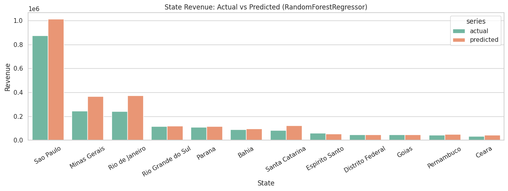

### Regression Visual (Cell 12, Plot 2)
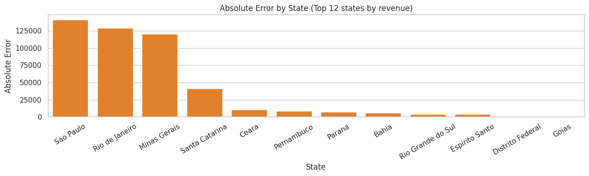

### Regression Visual (Cell 12, Plot 3)
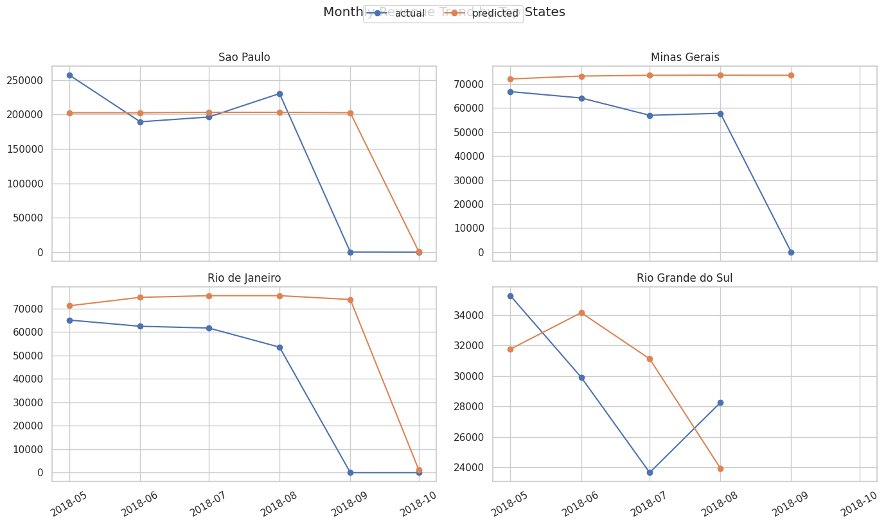

### Regression Visual (Cell 12, Plot 4)
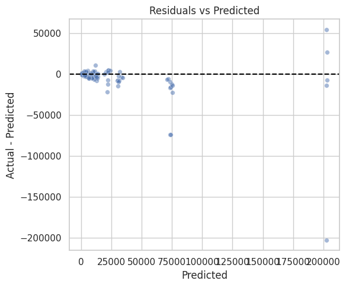

### Binary Classification Visual (Cell 15, Plot 1)
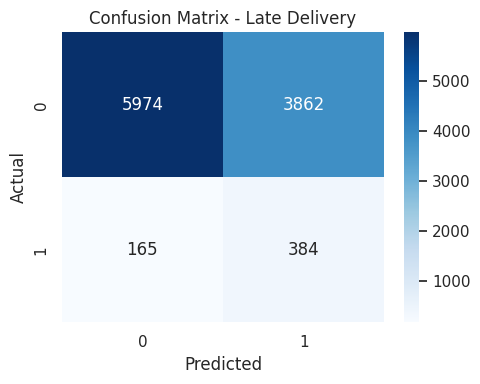

### Binary Classification Visual (Cell 15, Plot 2)
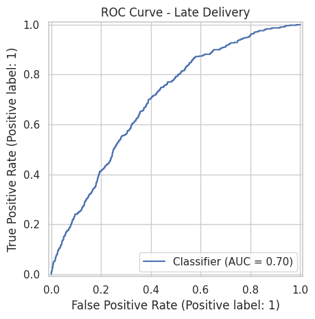

### Binary Classification Visual (Cell 15, Plot 3)
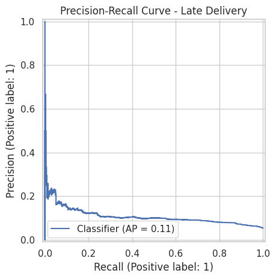

### Binary Classification Visual (Cell 15, Plot 4)
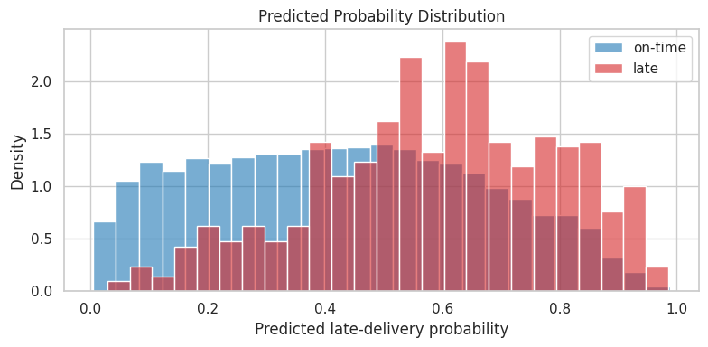

### Binary Classification Visual (Cell 15, Plot 5)
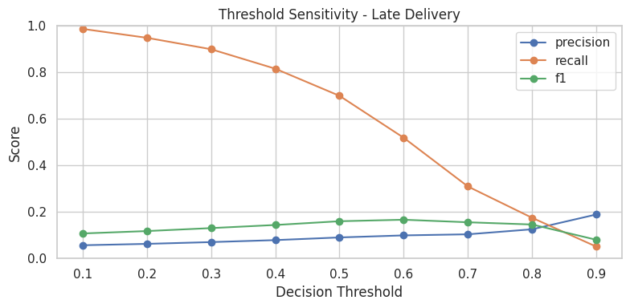

### Multiclass Classification Visual (Cell 18, Plot 1)
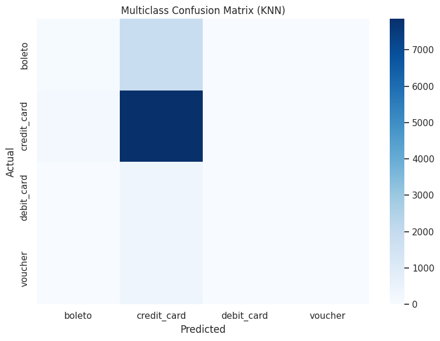

### Multiclass Classification Visual (Cell 18, Plot 2)
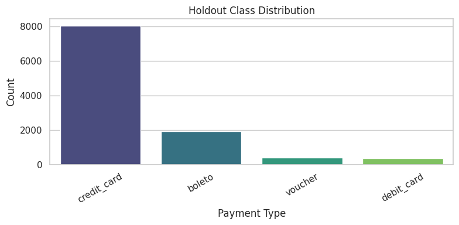

### Multiclass Classification Visual (Cell 18, Plot 3)
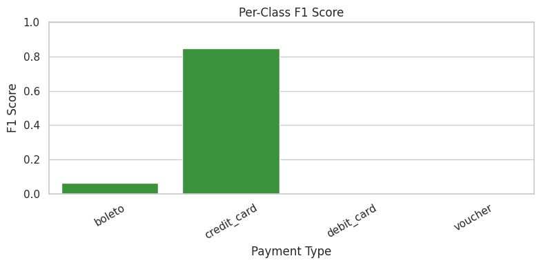

### Clustering Visual (Cell 20, Plot 1)
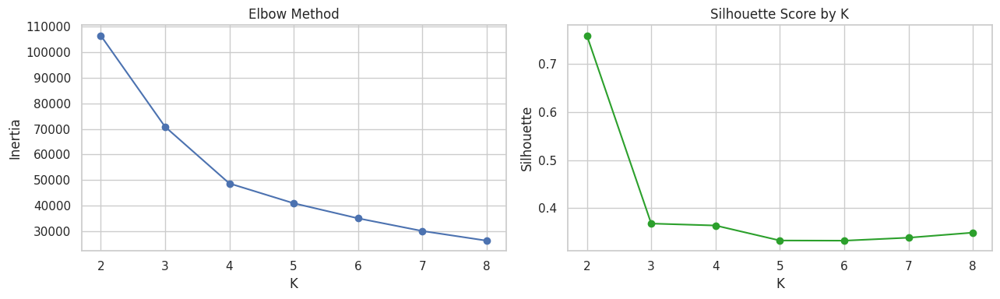

### Clustering Visual (Cell 20, Plot 2)
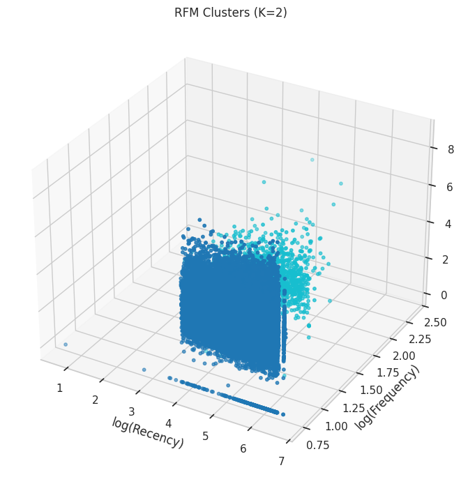

### Clustering Visual (Cell 20, Plot 3)
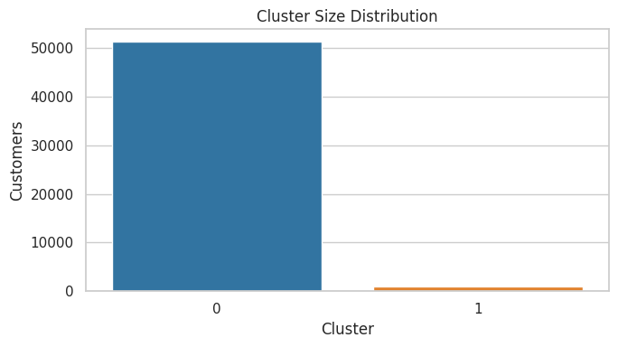

### Clustering Visual (Cell 20, Plot 4)
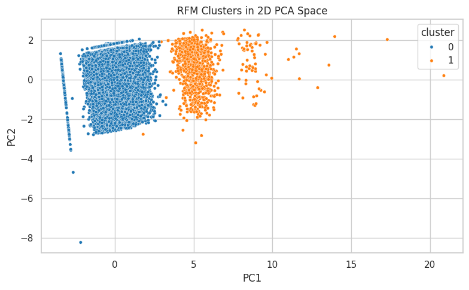

### NLP Visual (Cell 24, Plot 1)
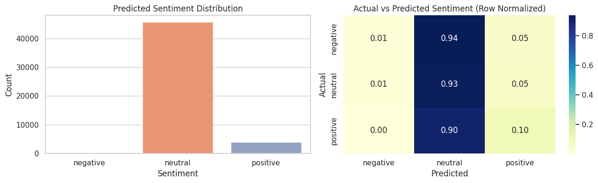

### NLP Visual (Cell 24, Plot 2)
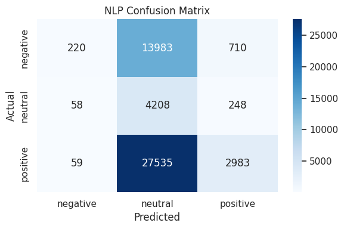

### Time-Series Base Visual (Cell 28, Plot 1)
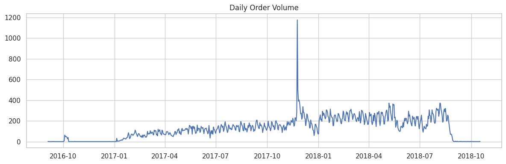

### Forecast Visual (Cell 30, Plot 1)
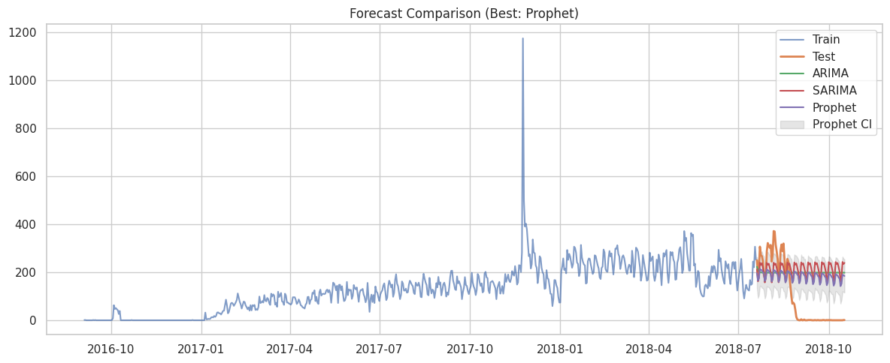

### Forecast Visual (Cell 30, Plot 2)
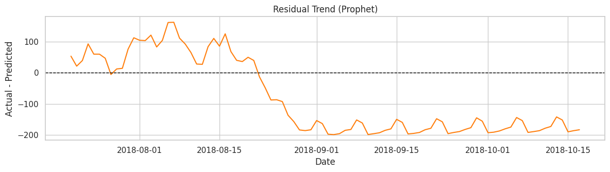

### Forecast Visual (Cell 30, Plot 3)
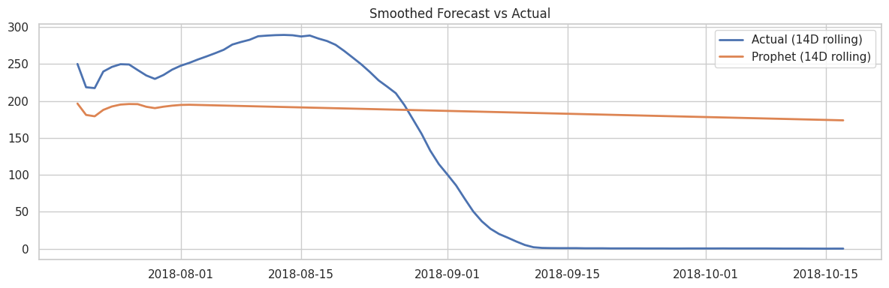
